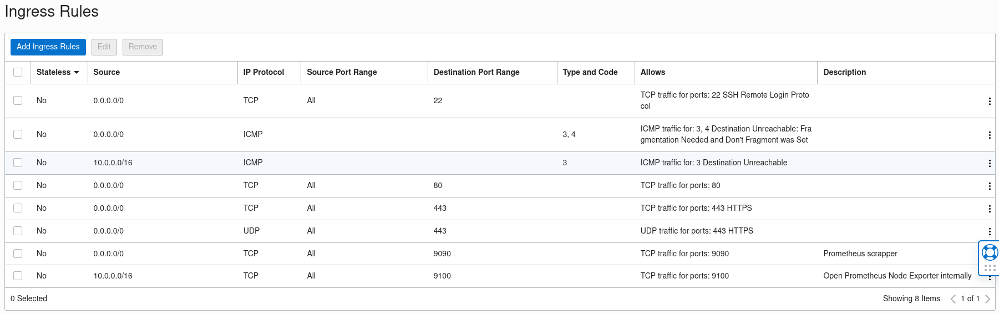

# Provisioning a home lab with Oracle cloud and Ansible

Imagine for a moment that you have been working hard to setup a website, protected with SSL, and then your hardware fails. This means that unless you have a perfect backup of your machine, you will need to install all the software and configuration files by hand.

What if it's not just one server but many? The amount of time you will need to fix all of them will grow exponentially – and because is a manual process it will be more error-prone.

And then the nightmare scenario: You don't have an up-to-date backup, or you have incomplete backups. Or the worst – there are no backups at all. This last case is more common than you think, especially in home labs where you are tinkering and playing around with stuff by yourself.

In this tutorial, I'll show you how you can do a full infrastructure provisioning of a pair of web servers on a Cloud provider, with SSL certificates and monitoring metrics with Prometheus.

## What do you need for this setup

* The first thing you need is a cloud provider; [Oracle Cloud](https://cloud.oracle.com) offers a Free Tier version of their cloud services, which allow you to setup virtual machines for free; This is great for a home lab with lots of rich features that you can use to try new tools and techniques.
* I used [Ansible](https://www.ansible.com/) because its very low requirements (you only need an SSH daemon and public key authentication to get things going), and also because it works equally well regardless of the cloud environment you are trying to provision; On this tutorial we will use the [Open Source version](https://github.com/ansible/ansible) of this tool, it is more than sufficient for our purposes.

# What is included in the playbook

* How you can maintain [clean inventory sources](https://www.redhat.com/sysadmin/ansible-dynamic-inventories) by using the proper layout in your playbooks.
* Provisioning of 2 NGINX instances, with the request of their proper free SSL certificates using [Certbot](https://certbot.eff.org/instructions?ws=nginx&os=pip).
* Then will set up the local Linux firewalls and will add a Prometheus node_exporter agent and one
* This playbook will cover concepts like variables, roles (with task inclusion), conditional execution
* You will see important techniques like task tagging, debug messages and static validation with [ansible-lint](https://www.redhat.com/sysadmin/ansible-lint-YAML)

## What do you need to know before you can try this

Because we will cover several tasks here, you will probably need to be familiar with several things (I'll provide links as we go along):

* This is not an [introductory course to Ansible](https://www.redhat.com/sysadmin/ansible-introduction) but more a "how all things fit together" with a more rich, but not too complex, playbook.
* An [OCI Cloud Free Tier](https://www.oracle.com/cloud/free/) account
* Privileged account, most likely [SUDO](https://www.sudo.ws/)
* Basic knowledge of [TCP/IP and firewalls with firewalld](https://www.redhat.com/sysadmin/firewalld-rules-and-scenarios)
* Usage of [RPM](https://www.redhat.com/sysadmin/how-manage-packages) and how to [package](https://www.redhat.com/sysadmin/package-linux-applications-rpm) applications (we will not do that here but, it helps to understand when an RPM is better than a complex task in Ansible)

## What is not included here

OCI Cloud has a [complete REST API](https://docs.oracle.com/en-us/iaas/api/#/en/network-firewall/20211001/NetworkFirewallPolicy/UpdateNetworkFirewallPolicy) to manage a lot of aspects of their cloud environment. [Their setup page](https://docs.oracle.com/en-us/iaas/Content/API/Concepts/sdkconfig.htm#SDK_and_CLI_Configuration_File) (specifically the SDK) is also very detailed.

## The fine print: You will probably do things differently in production.

### Installing the OCI-Metrics-datasource instead of Prometheus agents on a virtual machine

You can go to [this page](https://grafana.com/grafana/plugins/oci-metrics-datasource/?tab=installation) to install it on your Grafana instance (Bare metal or Cloud); Also you need to [setup your credentials and permissions as explained here](https://docs.oracle.com/en-us/iaas/Content/API/SDKDocs/grafana.htm).

This is probably the most efficient way to monitor your resources as you do not need to run agents on your virtual machines, but I will install instead a [Prometheus node_exporter agent](https://github.com/prometheus/node_exporter) and [Scrapper](https://github.com/prometheus/prometheus) that will be visible from a [Grafana Cloud](https://grafana.com/) instance.

### An exposed Prometheus on the Internet endpoint is not a good idea.

It is very clear, I'm exposing my prometheus scrapper to the Internet so Grafana cloud can reach it; On an Intranet with a private cloud and your local Grafana this is not an issue but here a Prometheus agent pushing data to Grafana would be a better option.

Still, Grafana provides a [list of public IP addresses](https://grafana.com/docs/grafana-cloud/reference/allow-list/) that you can use to setup your allow list.

So while the following will work:



But It is not the best, instead you want to restrict the specific IP addresses that can pull data from your exposed services; the prometheus exporter can be completely hidden from Grafana on port 9100, instead we only need to expose the prometheus scrapper that listens on port 9000.

For this home lab, it is not a big deal having such services fully exposed, but if you have a server with sensitive data, you must restrict who can reach the service!

An alternative to the Prometheus endpoint is to push the data to Grafana [by using a Grafana agent](https://grafana.com/docs/agent/latest/) but I will not cover that option here.

# Playbook analysis

Ansible lets you have a single file with the playbook instructions, eventually you will find out such structure is difficult to maintain.

For my playbook I decided to keep the suggested structure:

```shell
tree -A 
.
├── inventory
│   └── cloud.yaml
├── oracle.yaml
├── roles
│   └── oracle
│       ├── files
│       │   ├── logrotate_prometheus-node-exporter
│       │   ├── prometheus-node-exporter
│       │   └── requirements_certboot.txt
│       ├── handlers
│       │   └── main.yaml
│       ├── meta
│       ├── tasks
│       │   ├── controller.yaml
│       │   ├── main.yaml
│       │   ├── metrics.yaml
│       │   └── nginx.yaml
│       ├── templates
│       │   ├── prometheus-node-exporter.service
│       │   ├── prometheus.service
│       │   └── prometheus.yaml
│       └── vars
│           └── main.yaml
└── site.yaml
```

Below is a brief description of how the content is organized:

1. You can have more than one site, we control that inside the [site.yaml](site.yaml) file.
2. Our host list is inside the inventory directory; you can have more tha one inventory file or scripts to generate the hostlist, or a combination of both.
3. The roles/oracle group the tasks, we only have one role called 'oracle' because that's the cloud provider I'm focusing on
4. Our playbook uses metadata in the form of variables, each one defined on the 'vars' directory; that way we can customize the behaviour of the playbook in multiple places:
```yaml
---
# Common variables for my Oracle Cloud environments
controller_host: XXXX.com
ssl_maintainer_email: YYYYYY@ZZZZ.com
architecture: arm64
prometheus_version: 2.38.0
prometheus_port: 9090
prometheus_node_exporter_nodes: "['X-server1:{{ node_exporter_port }}', 'Y-server2:{{ node_exporter_port }}' ]"
node_exporter_version: 1.4.0
node_exporter_port: 9100
internal_network: QQ.0.0.0/24
```
5. The roles/oracle files directory contains files that can be copied as is to the remote directory; the templates' directory is similar but the files in there can be customized for each host by using [Jinja templating language](https://docs.ansible.com/ansible/latest/user_guide/playbooks_templating.html).
```yaml
# A template for the prometheus scrapper configuration file
---
global:
    scrape_interval: 30s
    evaluation_interval: 30s
    scrape_timeout: 10s
    external_labels:
        monitor: "oracle-cloud-metrics"

scrape_configs:
  - job_name: "node-exporter"
    static_configs:
      - targets: "{{ prometheus_node_exporter_nodes }}"
    tls_config:
      insecure_skip_verify: true
```
6. The 'tasks' directory is where we store our tasks, the actions that will modify the server state; Please not than Ansible will not execute tasks if is not necessary and the idea is that you can re-run a playbook as many times as needed and the final state will be the same

```yaml
# Fragment of the nginx tasks file. See how we notify a handler to restart nginx after the SSL certificate is renewed
---
- name: Copy requirements file
  ansible.builtin.copy:
    src: requirements_certboot.txt
    dest: /opt/requirements_certboot.txt
  tags: certbot_requirements

- name: Setup Certbot
  pip:
    requirements: /opt/requirements_certboot.txt
    virtualenv: /opt/certbot/
    virtualenv_site_packages: true
    virtualenv_command: /usr/bin/python3 -m venv
  tags: certbot_env

- name: Get SSL certificate
  command:
    argv:
      - /opt/certbot/bin/certbot
      - --nginx
      - --agree-tos
      - -m "{{ ssl_maintainer_email }}"
      - -d "{{ inventory_hostname }}"
      - --non-interactive
  notify:
    - Restart Nginx
  tags: certbot_install
```

7. There is one special directory called 'handlers'; There we define actions that must happen if a task changes the state of our host.

We have now a picture how all the pieces work together, so let's talk now about some specific details.

### Firewall provisioning

With Ansible, you can replace a sequence of commands like this:

```shell=
sudo firewall-cmd --permanent --zone=public --add-service=http
sudo firewall-cmd --permanent --zone=public --add-service=https
sudo firewall-cmd --reload
```

With [firewalld module](https://docs.ansible.com/ansible/latest/collections/ansible/posix/firewalld_module.html):

```yaml
---
- name: Enable HTTP at the Linux firewall
  firewalld:
    zone: public
    service: http
    permanent: true
    state: enabled
    immediate: yes
  notify:
    - Reload firewall
  tags: firewalld_https

- name: Enable HTTPS at the Linux firewall
  firewalld:
    zone: public
    service: https
    permanent: true
    state: enabled
    immediate: yes
  notify:
    - Reload firewall
  tags: firewalld_https
```

### Common tasks have nice replacements

So instead of running SUDO with a privileged command:

```shell=
sudo dnf install -y nginx
sudo systemctl enable nginx.service --now
```

You can have something like this:

````yaml
# oracle.yaml file, which tells which roles to call, included from site.yaml
---
- hosts: oracle
  serial: 2
  remote_user: opc
  become: true
  become_user: root
  roles:
  - oracle
# NGINX task (roles/oracle/tasks/nginx.yaml)
- name: Ensure nginx is at the latest version
  dnf:
    name: nginx >= 1.14.1
    state: present
    update_cache: true
  tags: install_nginx
# And a handler that will restart NGINX after it gets modified (handlers/main.yaml)
---
- name: Restart Nginx
  service:
    name: nginx
    state: restarted
- name: Reload firewall
  command: firewall-cmd --reload
````

## Running the playbooks

Normally you don't wait to have the whole playbook written, but you run the pieces you need in the proper order; at some point you will have your whole playbook finished and ready to go.

### Make sure the playbook behaves properly with --check before making any changes

The very first step is to check your playbook file for errors; for that you can use yamllint:

```shell
yamllint roles/oracle/tasks/main.yaml
```

But doing this for every yaml file in your playbook can be tedious an error-prone; as an alternative you can run the playbook in a 'dry-run' mode, to see what will happen without actually making any changes:

[](https://asciinema.org/a/537302)

Another way to gradually test a complex playbook is by executing a specific task by using a tag or group of tags; that way you can do controlled execution of your playbook:

_Keep in mind that this will not execute any dependencies that you may have defined on you playbook tough_:

[](https://asciinema.org/a/537303)

### Is it ansible-playbook --check good enough?

Some errors are more subtle and will not get caught with ansible-playbook --check. To get a more complete check on your playbooks before minor issues become a headache you can use [ansible-lint](https://ansible-lint.readthedocs.io/philosophy/), let's get it installed:

```shell
python3 -m venv ~/virtualenv/ansiblelint && . ~/virtualenv/ansiblelint/bin/activate
pip install --upgrade pip
pip install --upgrade wheel
pip install ansible-lint
```

Now we can check the playbook:

```shell
(ansiblelint) [josevnz@dmaf5 OracleCloudHomeLab]$ ansible-lint site.yaml 
WARNING  Overriding detected file kind 'yaml' with 'playbook' for given positional argument: site.yaml
WARNING  Listing 1 violation(s) that are fatal
syntax-check[specific]: couldn't resolve module/action 'firewalld'. This often indicates a misspelling, missing collection, or incorrect module path.
roles/oracle/tasks/nginx.yaml:2:3
```

Strange, firewalld is available on our Ansible installation. What else was installed by ansible-lint?:

```shell
(ansiblelint) [josevnz@dmaf5 OracleCloudHomeLab]$ ansible --version
ansible [core 2.14.0]
  config file = /etc/ansible/ansible.cfg
  configured module search path = ['/home/josevnz/.ansible/plugins/modules', '/usr/share/ansible/plugins/modules']
  ansible python module location = /home/josevnz/virtualenv/ansiblelint/lib64/python3.9/site-packages/ansible
  ansible collection location = /home/josevnz/.ansible/collections:/usr/share/ansible/collections
  executable location = /home/josevnz/virtualenv/ansiblelint/bin/ansible
  python version = 3.9.9 (main, Nov 19 2021, 00:00:00) [GCC 10.3.1 20210422 (Red Hat 10.3.1-1)] (/home/josevnz/virtualenv/ansiblelint/bin/python3)
  jinja version = 3.1.2
  libyaml = True
```

Ansible-lint installed its own ansible [core], and firewalld is part of [ansible.posix collection](https://docs.ansible.com/ansible/latest/collections/ansible/posix/firewalld_module.html), we will use [Ansible Galaxy](https://docs.ansible.com/ansible/latest/cli/ansible-galaxy.html) to install it:

```shell
(ansiblelint) [josevnz@dmaf5 OracleCloudHomeLab]$ which ansible-galaxy
~/virtualenv/ansiblelint/bin/ansible-galaxy
(ansiblelint) [josevnz@dmaf5 OracleCloudHomeLab]$ ansible-galaxy collection install ansible.posix
Starting galaxy collection install process
Process install dependency map
Starting collection install process
Downloading https://galaxy.ansible.com/download/ansible-posix-1.4.0.tar.gz to /home/josevnz/.ansible/tmp/ansible-local-18099xpw_8usc/tmp8msc9uf5/ansible-posix-1.4.0-_f17f525
Installing 'ansible.posix:1.4.0' to '/home/josevnz/.ansible/collections/ansible_collections/ansible/posix'
ansible.posix:1.4.0 was installed successfully
```

Running it again:

```shell
(ansiblelint) [josevnz@dmaf5 OracleCloudHomeLab]$ ansible-lint site.yaml 
WARNING  Overriding detected file kind 'yaml' with 'playbook' for given positional argument: site.yaml
WARNING  Listing 50 violation(s) that are fatal
name[play]: All plays should be named. (warning)
oracle.yaml:2

fqcn[action-core]: Use FQCN for builtin module actions (service).
roles/oracle/handlers/main.yaml:2 Use `ansible.builtin.service` or `ansible.legacy.service` instead.

fqcn[action-core]: Use FQCN for builtin module actions (command).
roles/oracle/handlers/main.yaml:6 Use `ansible.builtin.command` or `ansible.legacy.command` instead.
```

Some warnings are pedantic ('Use FQCN for builtin module actions (command)') and others require attention (Commands should not change things if nothing needs doing.).

Ansible-lint found many smells on the playbook, there is one option to re-write the files and correct some of these errors automatically:

[](https://asciinema.org/a/538053)

To me this more useful  I'll show you next the warning, the issue and the fix on a table that you can use as a guideline to correct this issues on your own playbooks:

| Issue name                                                        | Suggestion                                                         | Code with problem                                | Corrected code                                                   |
|-------------------------------------------------------------------|--------------------------------------------------------------------|--------------------------------------------------|------------------------------------------------------------------|
| fqcn[action-core]: Use FQCN for builtin module actions (command). | Use `ansible.builtin.service` or `ansible.legacy.service` instead. | - name: Restart Nginx<br>service:<br>name: nginx | - name: Restart Nginx<br>ansible.builtin.service:<br>name: nginx |


### Best practices


### Constraint where the playbook runs with --limit and --tags

Say that you are only interested in running your playbook on a certain host; you can also do that by using the 
--limit' flag:

```shell
ansible-playbook --inventory inventory --limit fido.yourcompany.com --tags certbot_renew site.yaml
```

[](https://asciinema.org/a/537304)

Here we did run only a task tagged certbot_renew on the host fido.yourcompany.com.

### Dealing with a real issue

Let's make this interesting; say that I was eager to update one of my requirements for certboot, and I changed versions 
if pip to '22.3.1':

```text
pip==22.3.1
wheel==0.38.4
certbot==1.32.0
certbot-nginx==1.32.0
```

When I run the playbook we have a failure:

[](https://asciinema.org/a/537318)

Let's revert the version of certbot from '1.32.0' to '1.23.0' and '22.3.1' to '21.3.1', loose the wheel version and see if that helps: 

To fix the mistake, I need to force the installation of the versions I want, ensuring I copy the requirements file:

```yaml
- name: Setup Certbot
  pip:
    requirements: /opt/requirements_certboot.txt
    virtualenv: /opt/certbot/
    virtualenv_site_packages: true
    virtualenv_command: /usr/bin/python3 -m venv
    state: forcereinstall
  tags: certbot_env
```

```shell
ansible-playbook --inventory inventory --tags certbot_env site.yaml
```

See it in action:

[](https://asciinema.org/a/537320)

### Running the whole playbook

```shell
ansible-playbook --inventory inventory site.yaml
```

[](https://asciinema.org/a/537322)

## Wrapping up

This tutorial only touches the surface of what you can do with Ansible, below are a few more links you should explore to learn more:

* Improving inventories: [How to create dynamic inventory files in Ansible](https://www.redhat.com/sysadmin/ansible-dynamic-inventories), [How to write a Python script to create dynamic Ansible inventories](https://www.redhat.com/sysadmin/ansible-dynamic-inventory-python), [How to write an Ansible plugin to create inventory files](https://www.redhat.com/sysadmin/ansible-plugin-inventory-files)
* Sometimes your playbooks will run slow, and you may need to [Assess resource consumption with Ansible callback plugins](https://www.redhat.com/sysadmin/ansible-callback-plugins-metrics).
* And there will be a time [when deeper debugging](https://docs.ansible.com/ansible/latest/user_guide/playbooks_debugger.html) is needed.
